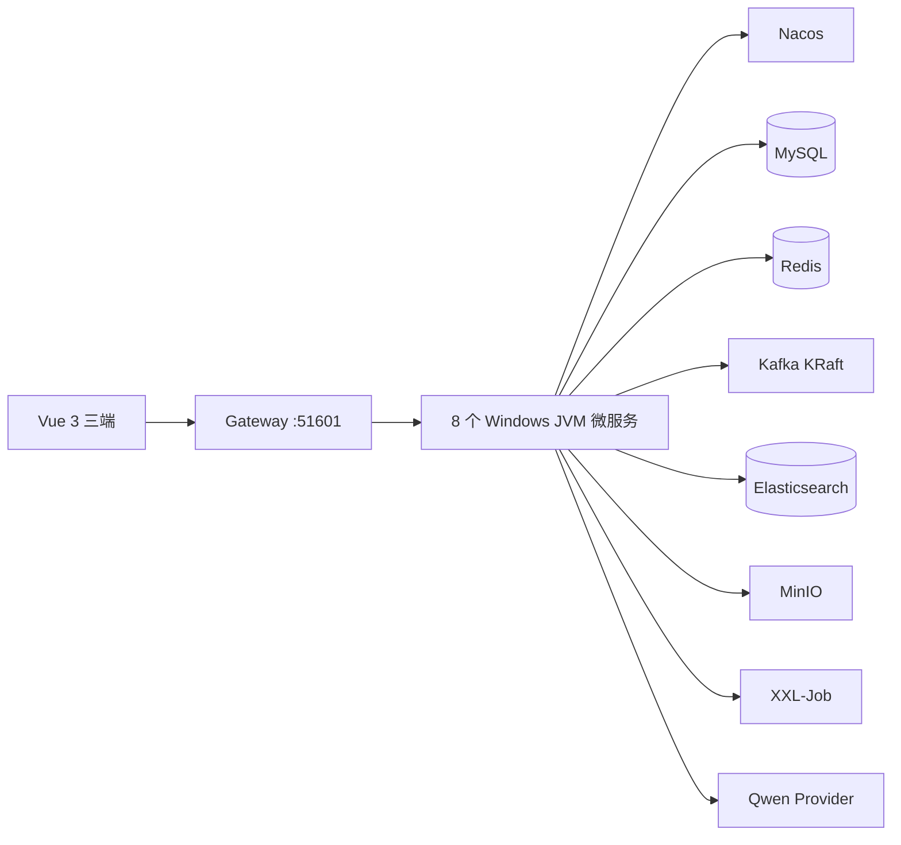
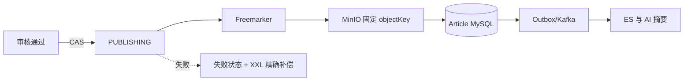
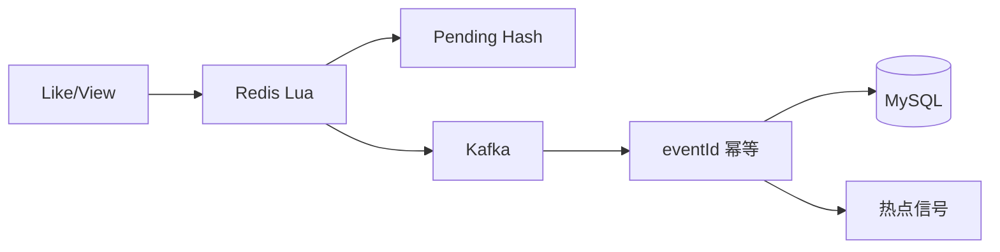
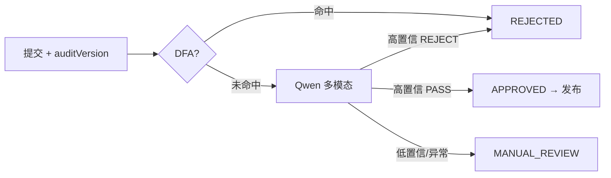
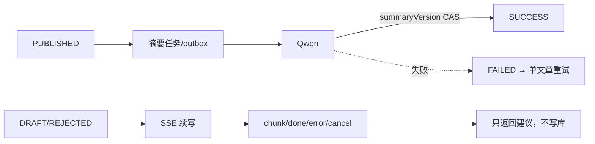

# Leadnews AI Platform

基于 Java 21、Spring Cloud 2025 与 Vue 3，从旧版教学项目重新设计实现的新闻微服务平台。它不是原代码升级拷贝：新工程重点建立清晰的领域边界、状态机、异步最终一致性、AI 安全兜底、动态流量治理和可恢复运维链路。

> 当前是单台 Windows + Docker Desktop 的开发/验收拓扑，不宣称生产集群、生产 SLA 或超大规模并发能力。

## 核心亮点

- 发布链路以 MySQL 状态机为真相源，用 CAS、事务任务、Kafka、确定性 MinIO objectKey 与补偿实现可恢复的最终一致性。
- 点赞/浏览使用 Redis Lua 原子更新，Kafka 异步落库，以 `eventId` 唯一键、pending Hash 和绝对计数避免重复与漂移。
- 搜索采用 MySQL outbox → Kafka → Elasticsearch；ES 故障不阻塞文章发布，恢复后自动收敛。
- 热点由 Kafka Streams 基于事件时间窗口聚合行为增量、Lua 原子更新 Redis ZSet，并按分钟衰减；MySQL checkpoint 用于空榜恢复。
- DFA 先行过滤，Qwen 多模态结构化审核，低置信度或异常转人工；`auditVersion` 防旧结果覆盖新稿件。
- 发布后异步生成 AI 摘要，失败不回滚文章；支持单文章精确恢复。SSE 续写可取消且绝不自动保存。
- Gateway 统一 JWT 信任边界、用户头清洗和内部接口隔离；Sentinel 规则由 Nacos 动态持久化。
- 三套 Vue 3 + TypeScript 前端共享认证、错误语义、DTO、安全高亮和 SSE 客户端。

## 技术栈

| 层次 | 技术与固定版本 |
| --- | --- |
| Java | Temurin JDK 21.0.12.1、Maven Wrapper 3.9.10 |
| 微服务 | Spring Boot 3.5.16、Spring Cloud 2025.0.3、Spring Cloud Alibaba 2025.0.0.0 |
| 数据 | MyBatis-Plus 3.5.17、MySQL 8.4.11、Redis 7.4.11、Elasticsearch 8.17.10 |
| 消息/调度 | Kafka 3.9.1 KRaft、Kafka Streams、XXL-Job 3.4.2 |
| AI | Spring AI 1.1.2、Spring AI Alibaba 1.1.2.2、Qwen `qwen3.8-max` |
| 治理/存储 | Nacos 3.0.3、Sentinel 1.8.9、Gateway、MinIO |
| 前端 | Vue 3.5.42、TypeScript 5.9.3、Vite 7.3.1、Pinia 4.0.3、Element Plus 2.14.5、pnpm 11.19.0 |

## 模块结构

```text
leadnews-common / leadnews-model / leadnews-feign-api
leadnews-gateway
leadnews-user-service / leadnews-article-service / leadnews-wemedia-service
leadnews-behavior-service / leadnews-search-service / leadnews-schedule-service
leadnews-admin-service / leadnews-ai-service
frontend/{leadnews-app,leadnews-wemedia,leadnews-admin,packages/shared}
```

服务只依赖公共模块和契约，不直接依赖其他业务服务；跨服务调用走 OpenFeign 或事件。

## 总体架构



## 关键链路

### 文章发布



### 高频行为



### AI 审核



### AI 摘要与续写



## 一致性与故障边界

项目不使用分布式事务，而是组合本地事务、CAS、唯一键、outbox/任务表、Kafka retry/DLT、Redis pending、确定性对象键、版本隔离和 XXL-Job 补偿。Redis 故障时行为写返回 503、文章读可降级 MySQL；ES 故障不影响发布；AI 审核故障转人工；摘要故障不改变 `PUBLISHED`；MinIO 失败保留可恢复状态。

## 本地运行

前置条件：Windows Docker Desktop、Temurin JDK 21、Node.js、Corepack。`.env` 被 Git 忽略，Qwen Key 只通过进程环境变量注入。

```powershell
cd D:\Toutiao\leadnews-ai-platform
Copy-Item .env.example .env
# 等价的基础设施原生命令：docker compose up -d
.\scripts\start-infra.ps1
.\scripts\check-infra.ps1
.\scripts\start-backend.ps1 -JavaHome D:\jdkk
.\scripts\health-check.ps1
.\scripts\start-frontend.ps1
```

Gateway 默认 `51601`；三个 Vite 默认 `5173/5174/5175`，Nginx production-dist 验收为 `18080/18081/18082`。端口冲突时显式换端口，不停止用户程序。

```powershell
$env:JAVA_HOME='D:\jdkk'
.\mvnw.cmd clean verify
cd frontend
corepack pnpm -r typecheck
corepack pnpm --filter @leadnews/shared test
corepack pnpm -r build
# 可选 production-dist 验收（先完成 build）：docker compose -f docker-compose.frontend.yml up -d
```

## 验证结果与边界

- 历史验收：JDK 21 Maven Reactor 13/13；三前端 typecheck、shared 5/5 测试、production build 通过。
- 本机正常区间 Article detail 205/205、P95 45.21 ms；Search 173/173、P95 48.35 ms，均无 5xx。
- Redis、ES、Kafka、AI、MinIO 故障均验证降级或恢复收敛。这些是 localhost 短时结果且受 Sentinel 阈值约束，不代表生产容量。

## 文档导航

- [项目亮点](docs/PROJECT_HIGHLIGHTS.md) · [架构决策](docs/ARCHITECTURE_DECISIONS.md) · [旧项目对照](docs/ORIGINAL_VS_REBUILD.md)
- [发布一致性](docs/PUBLISH_CONSISTENCY.md) · [行为](docs/BEHAVIOR_DESIGN.md) · [搜索](docs/SEARCH_DESIGN.md) · [热点](docs/HOT_ARTICLE_DESIGN.md)
- [AI](docs/AI_DESIGN.md) · [审核](docs/ARTICLE_AUDIT_FLOW.md) · [摘要](docs/AI_SUMMARY_DESIGN.md) · [SSE](docs/AI_CONTINUATION_DESIGN.md)
- [本地开发](docs/LOCAL_DEVELOPMENT.md) · [部署拓扑](docs/DEPLOYMENT_TOPOLOGY.md) · [API](docs/API.md)
- [简历](docs/RESUME_PROJECT.md) · [亮点源码链路](docs/RESUME_CODE_WALKTHROUGH.md) · [面试讲稿](docs/INTERVIEW_PROJECT_PITCH.md) · [高频问答](docs/INTERVIEW_QA.md) · [深挖题库](docs/INTERVIEW_DEEP_DIVE.md) · [STAR 案例](docs/INTERVIEW_STAR_CASES.md)

## 安全说明

API Key、数据库密码、MinIO Secret、JWT Secret 全部外部注入；`.env.example` 只能包含占位符或明确标注的非敏感本地默认值。AI API Key 不进入源码、Nacos、前端、Docker image 或文档真实值。运行日志和 PID 文件也被忽略。Gateway 删除外部伪造用户头并拒绝 `/internal/**`。当前内部标记只是本地开发边界，生产仍需网络隔离或服务身份认证。原项目仅只读分析，未复制业务代码。
